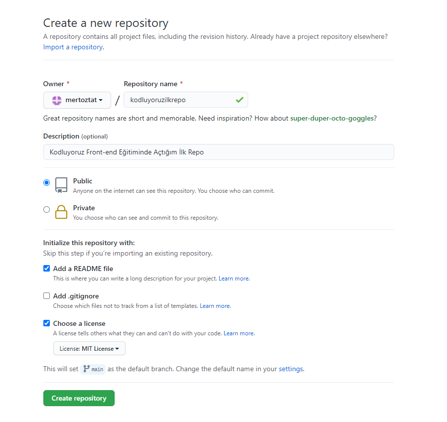

# Kodluyoruz İlk Repo
Bu repo [Kodluyoruz](https://courses.kodluyoruz.org/) Front-End Eğitiminde oluşturduğumuz ilk repo. İçerisinde bir adet README dosyası, bir adet de index.html barındırıyor.

# Instalattion
Öncelikle projeyi clonelayın. (Buraya sizin reponuzdan aldığınız link gelecek)
`
git clone https://github.com/esma6/kodluyoruzilkrepo.git
`

# Usage
Projeyi cloneladıktan sonra Visual Studio Code programında açınız.
Linux için:

`
cd kodluyoruzilkrepo code .

`

# Contributing
Pull requestler kabul edilir. Büyük değişiklikler için, lütfen önce neyi değiştirmek istediğinizi tartışmak için bir konu açınız.

# License
[MIT](https://choosealicense.com/licenses/mit/)
